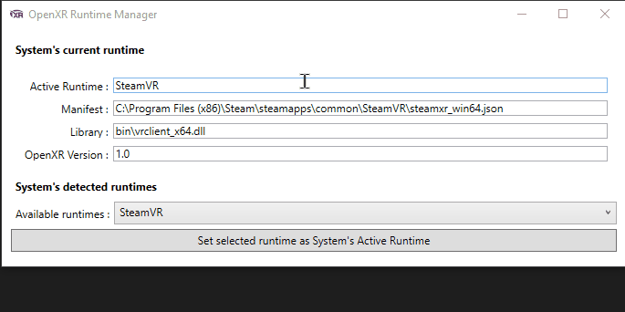

# OpenXR Runtime Manager

Small utility program that permit see the current OpenXR runtime, and select another one.

> This program needs to be ran as administrator, as it will edit a registry key in `HKLM\SOFTWARE\Khronos\OpenXR\1`.

## Compatibility

OpenXR runtimes do not "register" themselves as being installed in any meaningful way beside the one that is actively being used.

This program relies on a list of "well known" manifest file paths and currently support the following runtimes:

 - SteamVR
 - Oculus OpenXR
 - MixedRearlityRuntime
 - VarjoOpenXR

It would be really easy to add more supported runtimes, but I need to know the path where their install their json manifests.

*Note: This program currently do not handle configuring 32bit runtimes in a 64bit build.*

## Legal

Copyright :copyright: 2021-2022 Arthur Brainville (Ybalrid) - Licensed under the terms of the MIT License agreement.

*OpenXR™ is a trademark owned by The Khronos Group Inc. and is registered as a trademark in China, the European Union, Japan and the United Kingdom.*